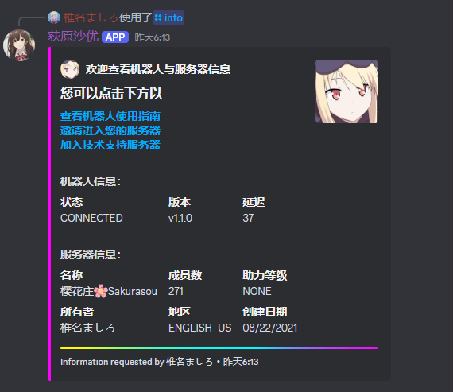
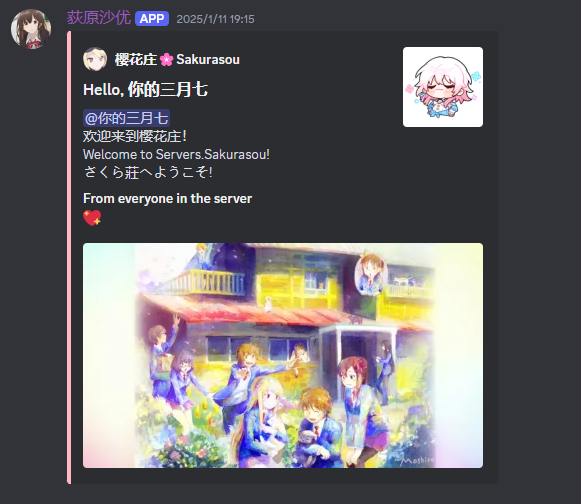
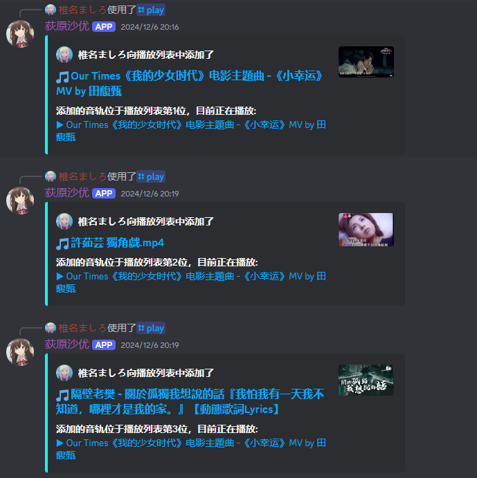
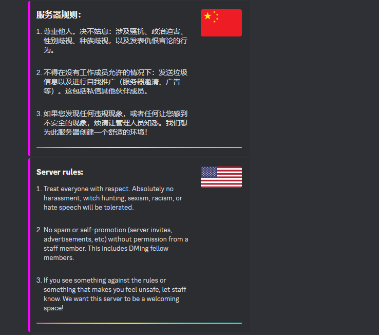
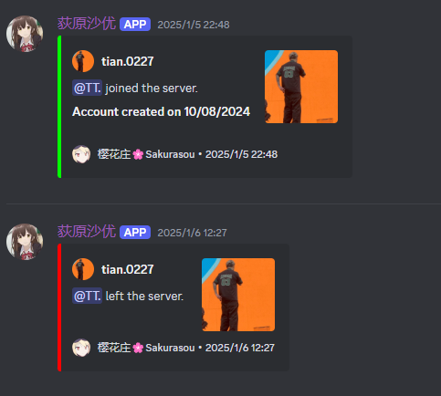

> [!TIP]
> For user manual in English, click [here](https://github.com/MashiroSakurasou/EN_DiscordBotUserManual).
> 
# Discord机器人 荻原沙优 用户指南 🌟

欢迎使用荻原沙优，一个功能丰富且高度可定制的 **音乐和管理 Discord 机器人**。以下是完整的使用指南！

## 🛠 **邀请机器人**
点击下方链接将机器人添加到您的服务器：  
👉 [邀请荻原沙优](https://discord.com/oauth2/authorize?client_id=1240521816582262845&permissions=8&integration_type=0&scope=bot)

## ⚙️ **斜杠命令指南**
### 命令总览
| 命令            | 描述                                                                                           |
|-----------------|----------------------------------------------------------------------------------------------|
| /play + 名称/链接 | 播放音频源，支持名称搜索或链接（YouTube、SoundCloud 等）。                                         |
| /skip           | 跳过当前播放的音频源。                                                                           |                                                                     |
| /info           | 查看服务器和机器人的详细信息。                                                                   | 
  
> [!TIP]
> 机器人会在 YouTube 上搜索您输入的音频名称，并播放第一个搜索结果。
> - 如果播放的不是您想要的音频，请尝试使用更具体的关键词（例如歌手姓名或专辑名称）。

> [!NOTE] 
> - **支持平台限制**：目前仅支持以下等平台的链接播放：**YouTube**、**SoundCloud**、**Bandcamp**、**Vimeo** 和 **Twitch 流媒体**。其他平台的链接可能无法播放。  
> - **播放列表限制**：对于 YouTube 播放列表，机器人会按顺序播放所有歌曲，但可能会根据网络状况略有延迟。  
> - **连接问题**：确保机器人已正确加入语音频道，且您的服务器权限允许机器人播放音频，否则命令可能无法正常工作。  
> - **版权问题**：请确保播放的内容符合相关版权法规，以避免潜在的侵权行为。

## 🎨 功能与客制化

/info 是在每个服务器中都可以使用的默认功能

  

除此之外，机器人支持多种可定制化功能，满足您个性化的需求

如有需要请加入我们的 [官方 Discord 服务器](https://discord.gg/67vMVwTNuG)并联系椎名ましろ（shiina.mashiro.）沟通定制需求

以下是一些示例

 1. 欢迎消息  2.点歌界面 3.服务器规则 4.成员记录
    
     

## 💬 **反馈与建议**
我们非常欢迎您的反馈和建议！  
加入我们的 [官方 Discord 服务器](https://discord.gg/67vMVwTNuG)，并私信 **椎名ましろ（shiina.mashiro.）** 报告问题或提出改进建议。  
